# Factory board game

Hello! Thanks for volunteering to test out a prototype of my board game! This is a game about building a factory. You and your friends will build your factories, trade resources on the market and complete contracts to earn victory points. Some contracts will step the game to the next tier, unlocking new components.

## Game setup

1. Separate all the pieces into tiers based on the number in the circle on their underside.
2. Shuffle all of the tier 1 contracts, deal four contracts face-up, and place the remaining contracts face down nearby.
3. Randomly take five tier 1 factory pieces per player and put them face-up in the centre of the table, accessible to all players.
4. Give each player a fund tracker set to $5.
5. Set the prices on the market to the marked positions for each resource.
6. Begin! The player with the longest name goes first.

## Round order

A round consists of two phases:

1. Construction phase. The current player chooses one of the following options and then play proceeds clockwise until every player has passed.
    * Claim a contract.
    * Buy a factory piece from the pool.
        * Reduce your funds by the tier value of the piece,
        * Refill the pool from the parts bag, and
        * Add the bought piece to your factory.
    * Pass.
2. Production phase.
    * Everyone gains three power tokens.
    * All unconnected or invalidly connected pieces are returned to the shared pool.
    * A dice is rolled.

    Then the current player chooses one of the following options and play proceeds clockwise until every player has passed.

    * Activate an eligible piece in your factory with a power token.
    * Buy or sell a resource on the market.
    * Pass.

## Activation

A piece can be activated during the production phase by placing a power token onto it from the player's hand. A piece can host a maximum of one power token. A piece can only be activated if ALL of its activation requirements are met. A piece is deactivated when its output is consumed by another piece connected to an output, or if its output is used to fulfill part of a contract.

### Dice roll
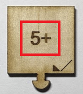

Some pieces are marked with a number and a plus symbol. These pieces cannot be activated unless a dice was rolled with an equal or higher value than that shown on the piece.

### Material requirement
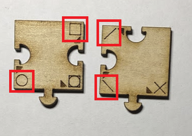

Some pieces are marked with a material symbol adjacent to a socket. These pieces cannot be activated unless every input is connected to a matching output on an activated piece.

## Parts
### Power Tokens

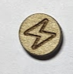

Power tokens are circular with a lightning bolt on them. These represent power in your factory. You add three to your hand at the start of the production phase. You can gain more by generating power in your factory. A piece can have a maximum of one power token on it. You can hold a maximum of five power tokens at a time.

### Mines

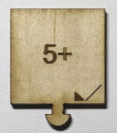

Mines produce raw material for your factory. They have a symbol next to the output peg that shows which material they produce.

### Machines

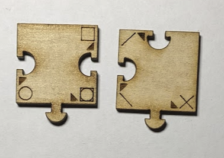

Machines are the pieces with input sockets and output pegs. Each input or output has a symbol showing which input it consumes, or which output it produces. A machine can be powered if all of its inputs are powered and you choose to place a power token on it. A machine is deactivated when its product is consumed by another piece connected to its output, or the output is used to fulfill a contract. When deactivated its power token is discarded to the shared pool

### Market

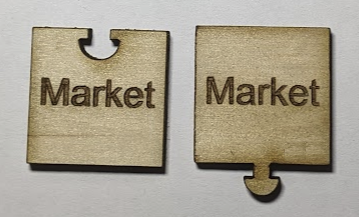

These pices allow resources to be bought and sold between your factory and the market. See "The Market", below. You must activate a market tile with a power token in order to bring resources into your factory from the market via that tile.

### Generators

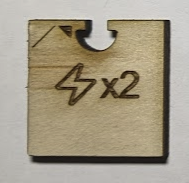

These pieces consume a particular resource and produce power tokens. When all inputs are activated the power tokens enter your hand directly from the shared pool. You do not need to play a power token onto a generator to activate it.

PROBLEM: In the current incarnation a mine can be activated multiple times during the production phase as long as the player has power tokens. This means it is easy to generate infinite power. Consider removing/reworking generators, or limiting the number of times a mine can be activated. That's hard to track though.

### Conveyors

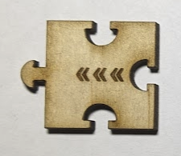

Conveyors are the pieces with the “«««” symbol. Conveyors move resources around your factory, from their inputs to their output. Conveyors can be chained together. You are not allowed to mix different resources on a conveyor - a conveyor can only convey one resource type to one destination. If multiple producers feeding a conveyor are powered you can choose which producer to depower to activate the consumer at the end of the conveyor chain.

In this example there are two circle mines feeding onto a conveyor, leading to the circle input of a machine. This is a valid configuration, and a good way to ensure your machine has a steady supply of circle resources!

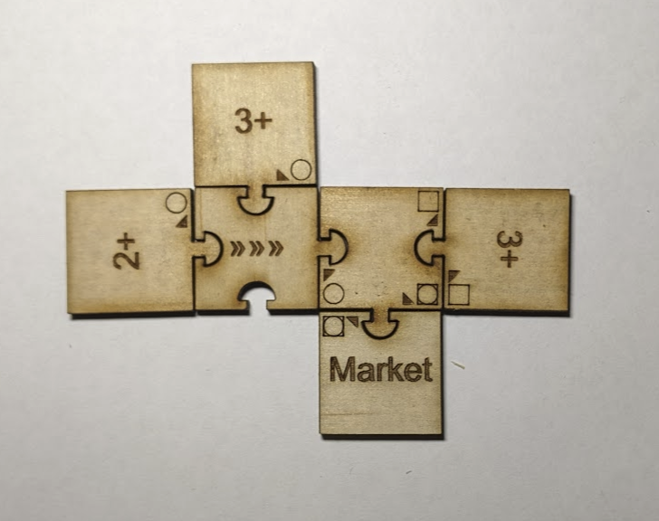

In this example there are two different resources feeding onto the same conveyor, and one of them does not match the resource type on the input to the machine! Calamity! (Disregard the colour of the pointer triangle - this is a prototyping issue)

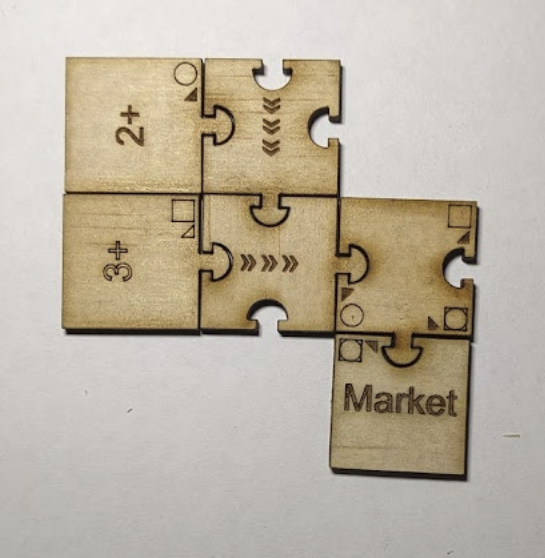

## The Market

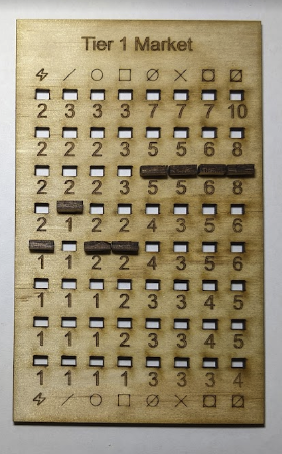

NOTE: This picture of the market board does not show the starting position lines.

The market is a shared board that tracks the prices of resources on the market. Selling resources onto the market drives the price down as it becomes more abundant, buying resources drives the price up as it becomes more scarce. Resources are imported and exported from a player's factory via Market pieces. If the peg reaches the limit of the market board that resource can still be bought or sold for the indicated price without moving the peg.

### Market example

I would like to use my factory to produce a cross resource. I have three power tokens, and a 5 was rolled on the die.

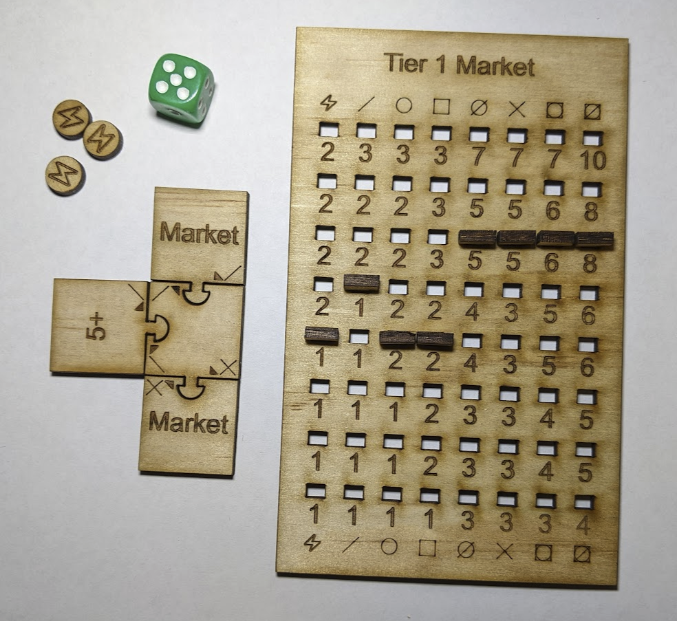

Because the diagonal mine can activate on a five or higher I am able to spend one of my power tokens activating it.

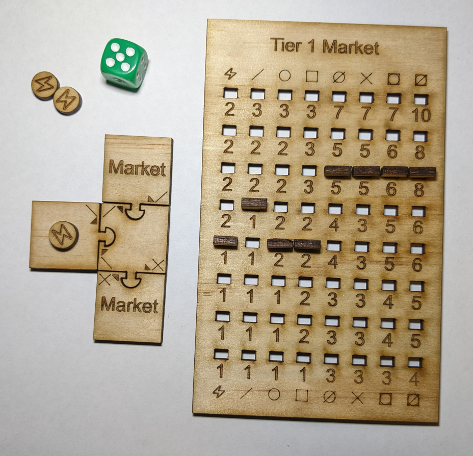

I am going to buy another diagonal resource on the market to activate the other input of my cross factory. I move the pin one place up the diagonal resource track.

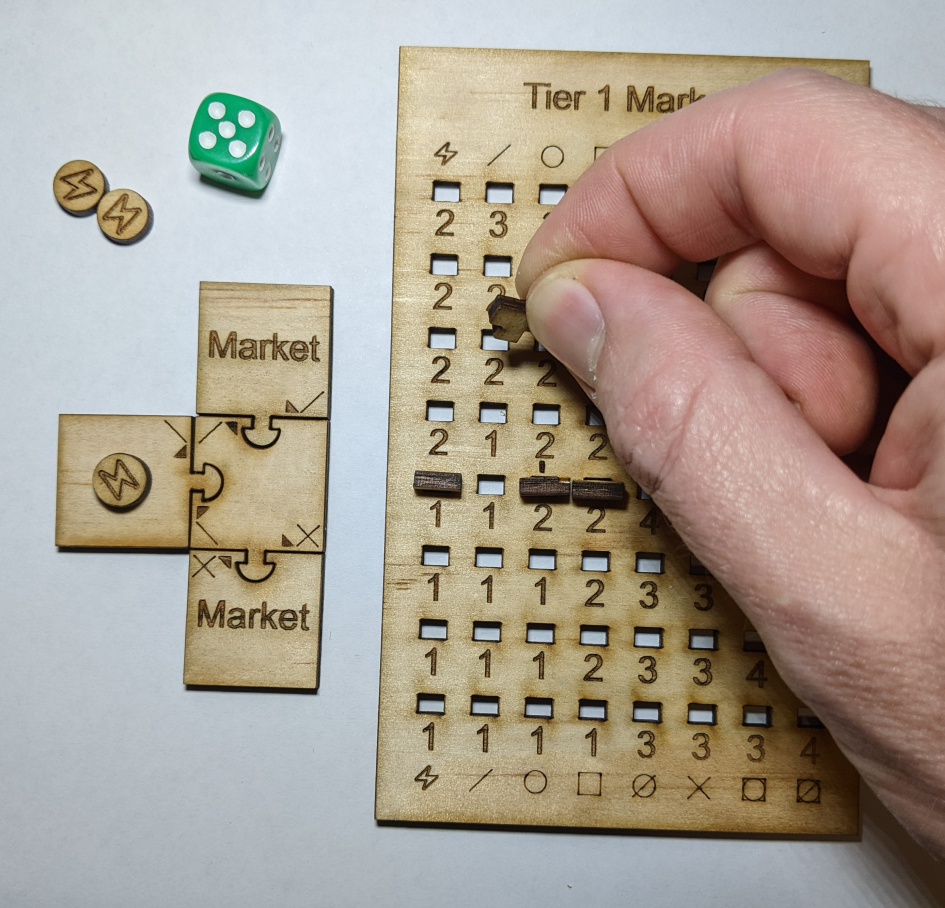

I pay $2 to buy the resource.

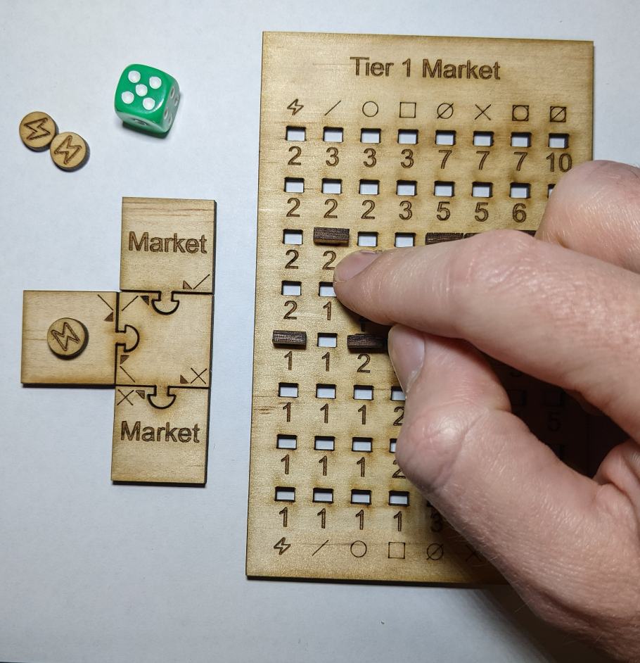

I place one of my remaining power tokens on the market producer tile.

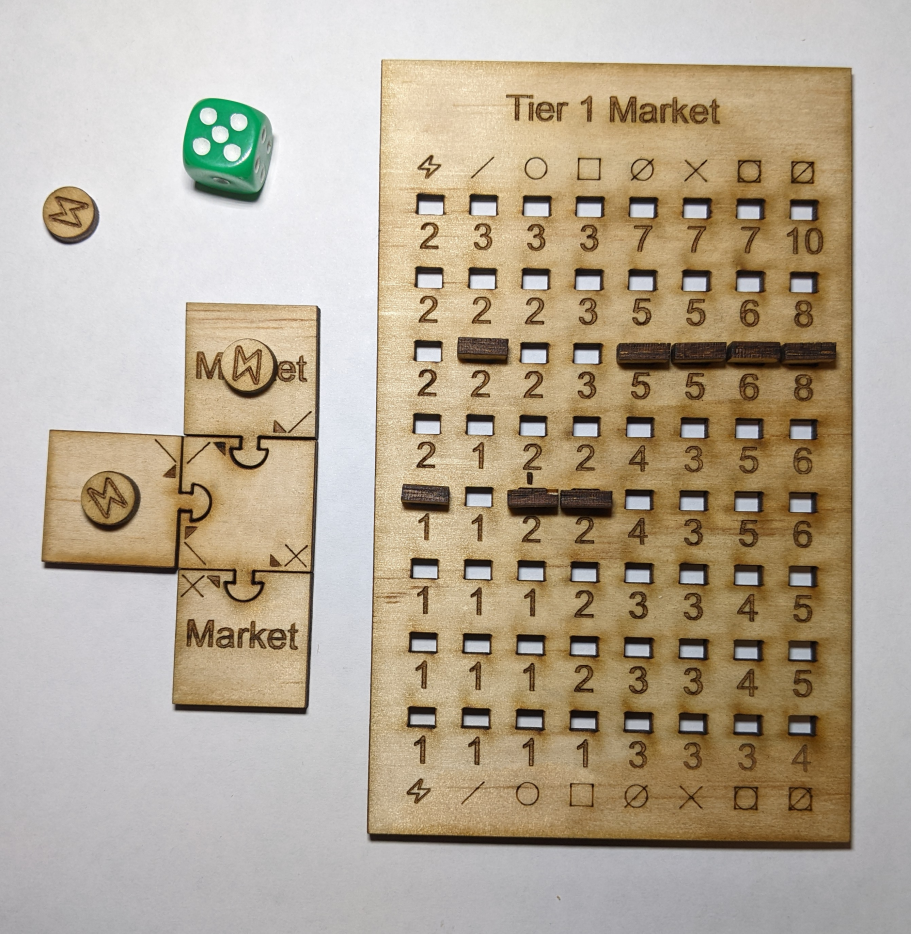

I place my last power token on my cross factory, discarding the two power tokens to the shared pool.

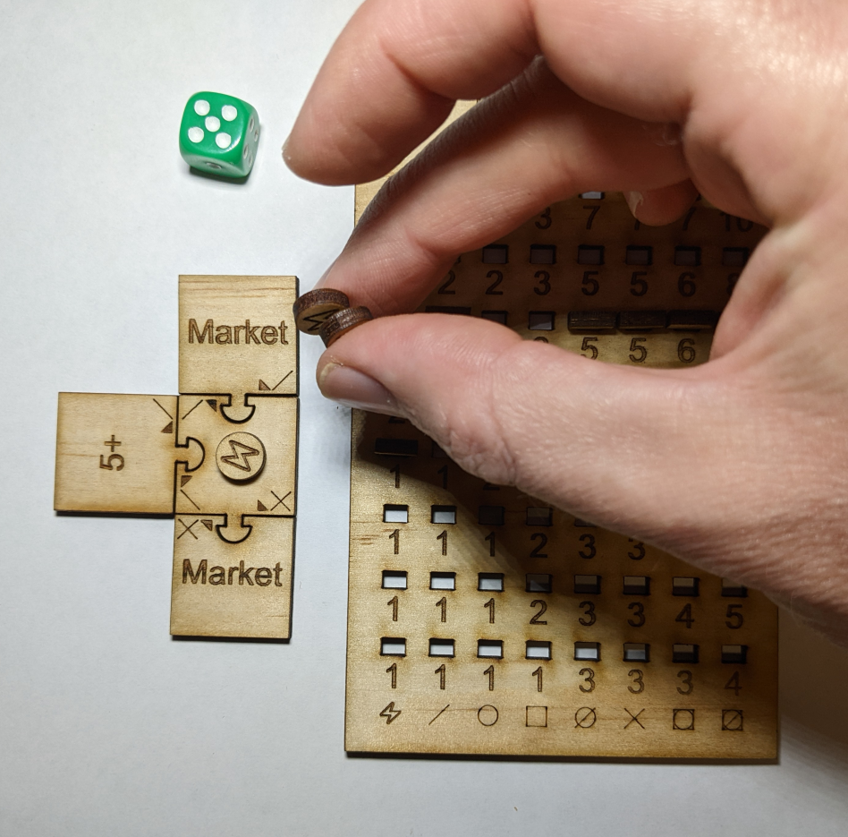

Now the market can be activated. This does not take any power.

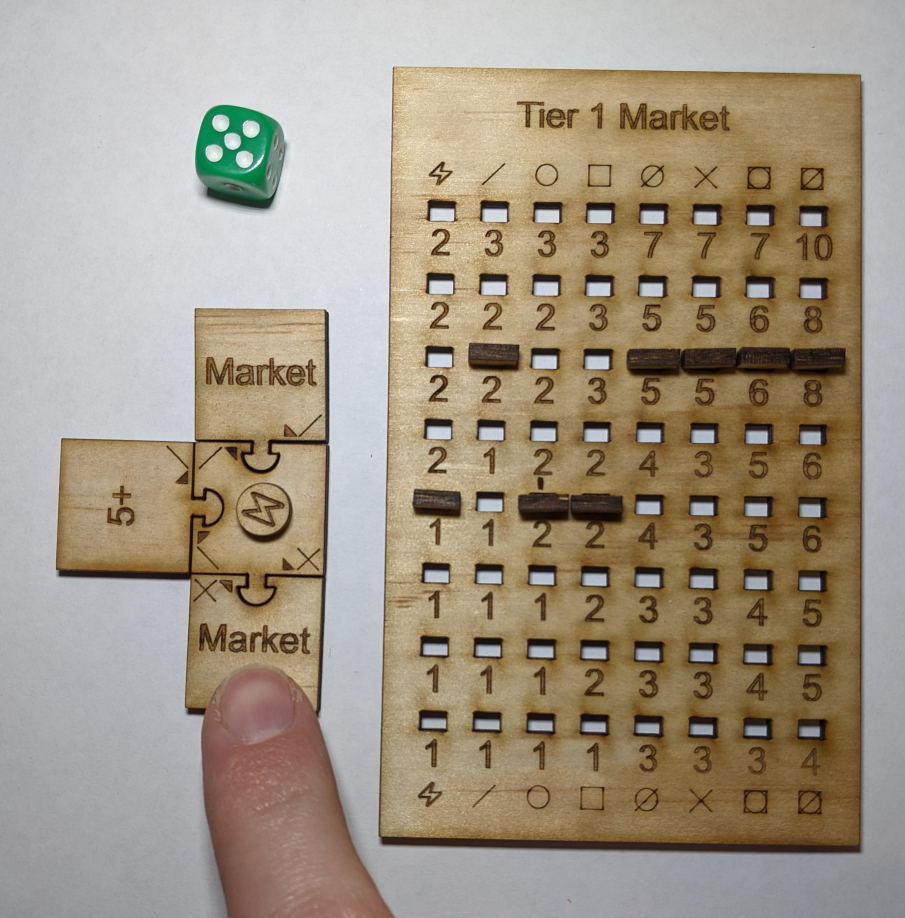

I move the pin down one position on the cross resource track.

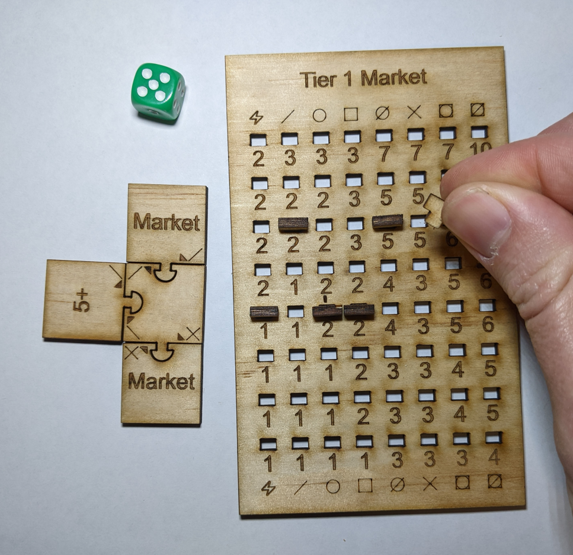

I collect $3 for the sale.

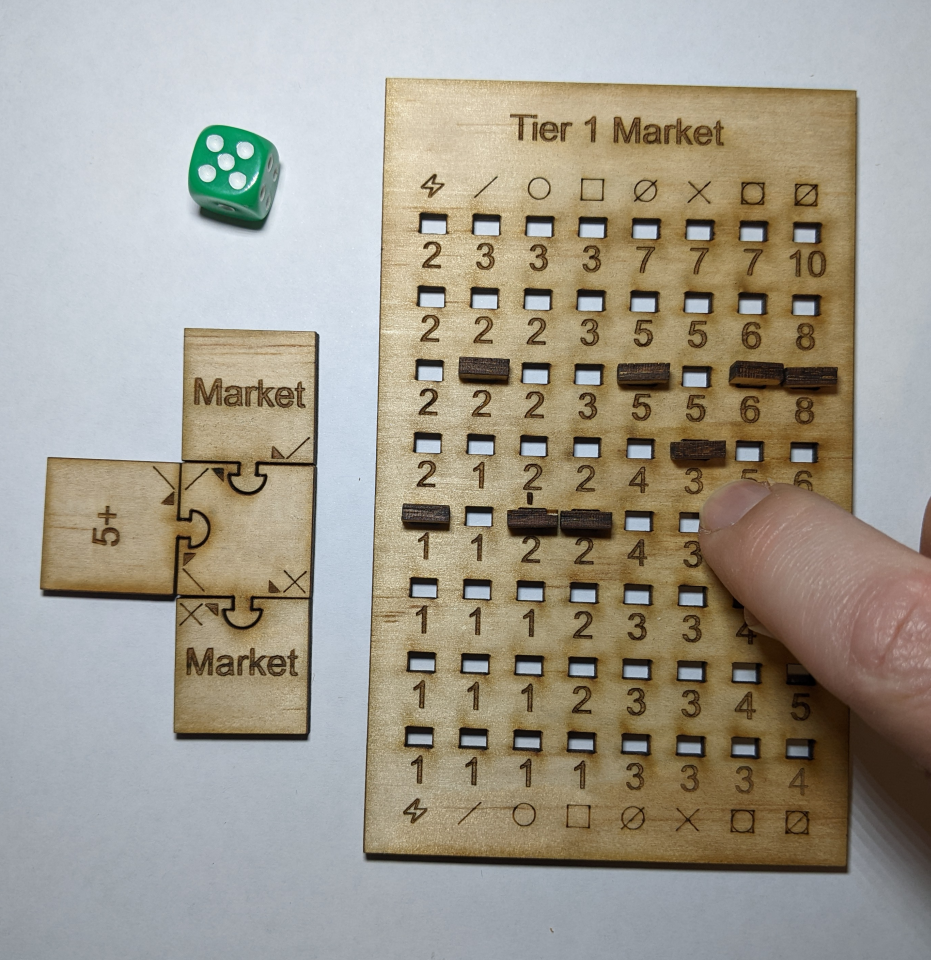

### Buying
When buying a resource from the market you move the peg up one position in the corresponding column and pay the price below the destination hole. You then place a power token from your hand on the market tile in your factory for that resource.

### Selling
When selling a resource to the market you move the peg down one position in the corresponding column and earn the price below the destination hole. You do not need to activate a market piece to sell.

### Power
NOTE: Power can no longer be traded on the market. Ignore that column on the market board if your set has one.

## Tiers
The game starts at tier 1. As the game progresses further tiers will be unlocked. New components are added to the game with each tier unlock. Tiers are advanced by completing special tier upgrade contracts.

## Contracts

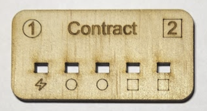

A contract is an agreement that you will produce a certain amount of resources in a certain time. At the start of the game some contracts are dealt face-up. You can opt to claim a contract on your turn, and the empty spot is replaced with a contract from the face-down pile. Completing contracts earns victory points, and some contracts also advance the game’s tier. If the game advances to the next tier, unfulfilled contracts from the current tier become void and count as negative victory points.

To fulfil a contract you must spend a resource of the type below a hole on the contract card, and place a pin in that hole. Once all holes are filled the complete and the victory points are scored. The resource can be taken from any powered producer of that type anywhere in your factory, or directly from your hand in the case of power tokens.

PROBLEM: Can contracts be fulfilled by resources bought from the market?