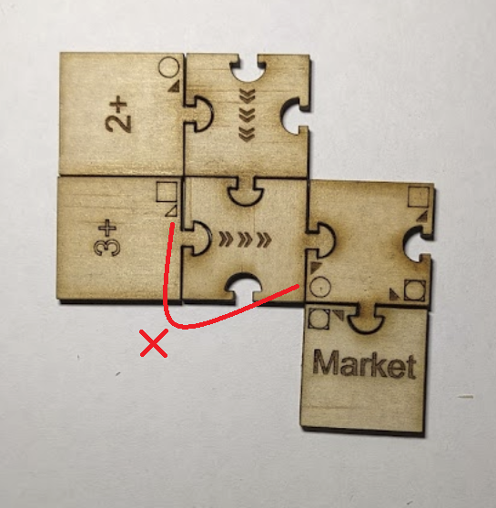

# Factory board game

Hello! Thanks for volunteering to test out a prototype of my board game! This is a game about building a factory. You and your friends will build your factories, trade resources on the market and complete contracts to earn victory points. Some contracts will step the game to the next tier, unlocking new components.

## Game setup

1. Separate all the pieces into tiers based on the number in the circle on their underside,
2. Shuffle all of the tier 1 contracts, deal four contracts face-up, and place the remaining contracts face down nearby,
3. Put all the tier 1 factory pieces in a pile in the centre of the table, accessible to all players.
4. Give each player a fund tracker set to $10,
5. Begin! The player with the longest name goes first and play proceeds clockwise.

## Round order

1. Player turns. Each player chooses one of the following actions:
    * Roll a dice for production. All players benefit,
    * Buy new factory pieces from the pool,
    * Buy or sell resources from the market,
    * Declare a shutdown to rebuild your factory. Start a 1 minute timer. When the timer runs out you must accept your factory as-is.
2. Production:
    * Everyone gains three power tokens,
    * A dice is rolled, every mine with an equal or higher number can be activated if you have the power tokens available,
    * Every machine with all inputs activated can be activated, if you have power tokens available. This deactivates its inputs.
    * Remaining unused power tokens return to the pool.

## Parts
### Power Tokens

Power tokens are circular with a lightning bolt on them. These represent power in your factory. You gain three at the start of the production phase. You can generate more power in your factory. Power tokens are lost to the shared pool when removed from your factory, or at the end of the production phase.

### Mines

Mines are the pieces with a number and a plus symbol in the centre. They produce raw material for your factory. They have a symbol next to the output peg that shows which material they produce. If a dice is rolled with a value equal to or higher than the number on the mine you can choose to place a power token on it to activate it. The power token is removed from the mine and returned to the shared pool when the resource is consumed from the mine.

### Machines

Machines are the pieces with inputs sockets and outputs pegs. Each input or output has a symbol showing which input it consumes, or which output it produces. A machine can be powered if all of its inputs are powered and you choose to place a power token on it. When the output of a machine is consumed, its power token is removed and returned to the shared pool.

### Market

These pieces allow a particular resource to be purchased or sold to the market. Each type of resource on the market has one producer tile, for buying resources from the market, and one consumer tile, for selling resources to the market. See "The Market" below.

### Generators

These pieces consume a particular resource and produce power tokens. When all inputs are activated the power tokens enter your hand directly from the shared pool.

### Conveyors

Conveyors are the pieces with the “«««” symbol. Conveyers move resources around your factory, from their inputs to their output. Conveyors can be chained together. You are not allowed mix different resources on a conveyor - a conveyor can only convey one resource type to one destination. If multiple producers feeding a conveyor are powered you can choose which producer to depower to activate the consumer at the end of the conveyor chain.

In this example there are two circle mines feeding onto a conveyer, leading to the circle input of a machine. This is a valid configuration, and a good way to ensure your machine has a steady supply of circle resources!

In this example there are two different resources feeding onto the same conveyor, and one of them does not match the resource type on the input to the machine! Calamity!

## Construction
### Buying and adding pieces
If you choose to buy on your turn, pieces can be taken from the shared pool and placed directly into your factory, or placed into your reserve. Pieces can be added from your reserve any time during the game. Pieces cost their tier value.

### Moving and removing pieces
You cannot move or remove a piece from your factory without declaring a "shutdown" on your turn. This takes your whole turn. You have one minute from your declaration to rearrange your factory with the pieces you have, including your reserve. When one minute has passed your factory is locked, and any unplaced pieces enter your reserve.

## The Market

The market is a shared board that tracks the prices of resources on the market. Selling resources onto the market drives the price down as it becomes more abundant, buying resources drives the price up as it becomes more scarce. Resources are imported and exported from a player's factory via Market tiles. You can only trade on the market if you choose the Trade action on your turn.

### Market example

I would like to use my factory to produce a cross resource. I have three power tokens, and a 5 was rolled on the die.

Because the diagonal mine can activate on a five or higher I am able to spend one of my power tokens activating it.

I am going to buy another diagonal resource on the market to activate the other input of my cross factory. I move the pin one place up the diagonal resource track.

I pay $2 to buy the resource.

I place one of my remaining power tokens on the market producer tile.

I place my last power token on my cross factory, returning the two power tokens from the market producer and mine tiles to the shared pool.

Now the market can be activated. This does not take any power.

I move the pin down one position on the cross resource track.

I collect $3 for the sale.

### Buying
When buying a resource from the market you move the peg up one position in the corresponding column and pay the price below the destination hole. You then place a power token from your hand on the market tile in your factory for that resource.

### Selling
When selling a resource to the market you move the peg down one position in the corresponding column and earn the price below the destination hole.

### Power
Power can be traded on the market directly from your power pool, without having to go via an import or export piece.

## Tiers
The game starts at tier 1. As the game progresses further tiers will be unlocked. New components are added to the game with each tier unlock. Tiers are advanced by completing special tier upgrade contracts.

## Contracts

A contract is an agreement that you will produce a certain amount of resources in a certain time. At the start of the game some contracts are dealt face-up. You can opt to claim a contract, and the empty spot is replaced with a contract from the face-down pile. Completing contracts earns victory points, and some contracts also advance the game’s tier. If the game advances to the next tier, all contracts from the current tier become void and count as negative victory points.

To fulfill a contract you must spend a resource of the type below a hole on the contract card, and place a pin in that hole. Once all holes are filled the complete and the victory points are scored. The resource can be taken from any powered producer of that type anywhere in your factory, or directly from your hand in the case of power tokens.